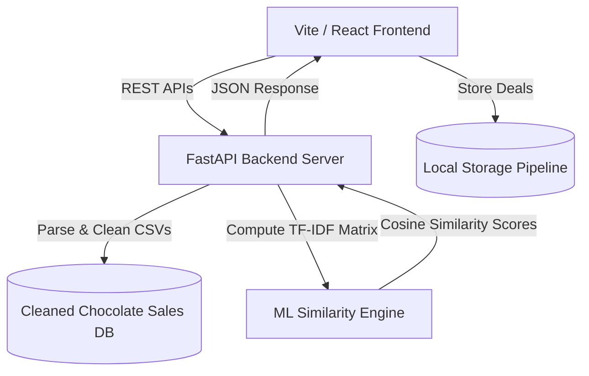

# 🌌 AppleSalesGennie AI: Sales Intelligence & Deal Analytics Platform

AppleSalesGennie AI is a premium, full-stack web application designed for chocolate sales transaction tracking, pipeline management, and AI-powered sales enablement. Built to replace basic static spreadsheets, it combines a robust **Python FastAPI backend** executing machine learning similarity matching algorithms on chocolate sales records with a beautiful, responsive **React + Tailwind CSS frontend** implementing a glassmorphic dashboard interface.

---

## 🏗️ Architecture



---

## 🌟 Key Features

### 1. 🔍 Interactive Sales Explorer
*   **Search & Multi-Filtering:** Instantly filter deals by Sales Representative, Product name, and Target market country (e.g. UK, USA, Canada, India).
*   **Dynamic Sorting:** Sort on the fly by Date, Revenue (Amount), or Volume (Boxes Shipped).
*   **AI Deal Quality Score:** Evaluates transaction metrics dynamically against targeted focus chocolate categories to compute a quality/margin compatibility percentage ($0\% - 100\%$) categorized into Match Levels (Premium Value Deal, High Performance, Optimal Volume, Low Margin Deal).
*   **Detailed Insights Overlay:** Visualizes salesperson rank, lifetime total sales, transaction volume metrics, unit values ($/box), and regional export channels.

### 2. 📋 Deal Pipeline Kanban Tracker
*   **Pipeline Stages:** Track custom active deals across stages including *Lead / Prospect*, *Contacted*, *Proposal Sent*, *Negotiation*, and *Closed Won*.
*   **Local Persistence:** Uses `localStorage` under `applesalesgennie_pipeline` so your active deals are persisted across browser reloads.

### 3. 🤖 AI Pitch Generator Workspace
*   **Contextual Pitch Drafting:** Automatically formulates customized client follow-up and sales messages using transaction metadata.
*   **Channel Customization:** Adjust formatting automatically for **Email** (formal header/subject), **WhatsApp** (bolding, symbols), or **LinkedIn** (professional networking note).
*   **Tone Customizer:** Select from multiple professional settings including *Persuasive*, *Professional*, *Friendly*, or *Urgent* to tailor the outreach copy.

### 4. 📊 Sales Performance Analytics Dashboard
Custom-crafted responsive SVG charts that dynamically render analytics fetched from the sales dataset:
*   **Product Revenue Share:** Top products ranked by total revenue contribution.
*   **Market Performance by Country:** Regional deal density and average deal sizes across export markets.
*   **Revenue vs. Quantities Correlation:** Scatter plot mapping quantity shipped (boxes) against total deal revenue to identify margin optimization.
*   **Monthly Revenue Trends:** Line chart visualizing transaction volume spikes and periodic fiscal trends.
*   **Sales Representative Rankings:** Renders sales agents ranked by volume, deals closed, and average transaction values.

---

## 🛠️ Technology Stack

### Backend (API & ML Engine)
*   **FastAPI:** High-performance, low-latency web framework for building APIs with Python.
*   **Uvicorn:** ASGI web server implementation.
*   **Pandas & NumPy:** Data manipulation and cleansing of relational tables.
*   **Scikit-Learn:** Employs `TfidfVectorizer` to tokenize transaction metadata (salesperson, product, country, date). Computes pairwise `linear_kernel` (Cosine Similarity) over vectors on the fly in $< 0.1\text{s}$ to recommend similar sales context.

### Frontend (User Interface)
*   **Vite + React:** Fast and optimized React development environment.
*   **Tailwind CSS:** Modern utility-first CSS styling with customized dark-slate theme palettes.
*   **Lucide React:** Sleek, consistent line icon system.
*   **Vanilla SVG Charts:** Custom responsive SVGs for charts.

---

## 📡 API Reference

The backend provides several REST endpoints:

| Endpoint | Method | Description |
| :--- | :---: | :--- |
| `/` | `GET` | Server status and documentation links. |
| `/api/products` | `GET` | Fetches a sorted list of unique products. |
| `/api/countries` | `GET` | Fetches a sorted list of unique destination markets. |
| `/api/sales` | `GET` | Fetches a paginated, filtered, and sorted list of sales transactions. |
| `/api/sales/{transaction_id}` | `GET` | Retrieves detailed metadata, representative rank, lifetime sales, and pricing details. |
| `/api/sales/{transaction_id}/recommendations` | `GET` | Returns top similar transactions using the similarity matching engine. |
| `/api/analytics` | `GET` | Computes statistical summaries and data distributions for charts. |
| `/api/generate-pitch` | `POST` | Generates a custom styled client pitch based on tone, channel, and client. |

---

## 🚀 How to Run the Project

### Prerequisites
*   Python 3.8+
*   Node.js 18+ & npm

### Step 1: Run the Backend Server
1. Navigate to the backend directory:
   ```bash
   cd salesgenie/backend
   ```
2. Install Python dependencies:
   ```bash
   pip install -r requirements.txt
   ```
3. Launch the FastAPI server:
   ```bash
   python3 server.py
   ```
*The backend API documentation will be available at `http://127.0.0.1:8000/docs`.*

### Step 2: Run the Frontend App
1. Navigate to the frontend root directory:
   ```bash
   cd salesgenie
   ```
2. Install Node dependencies:
   ```bash
   npm install
   ```
3. Run the development server:
   ```bash
   npm run dev
   ```
*Open `http://localhost:5173/` in your browser to view the application.*
