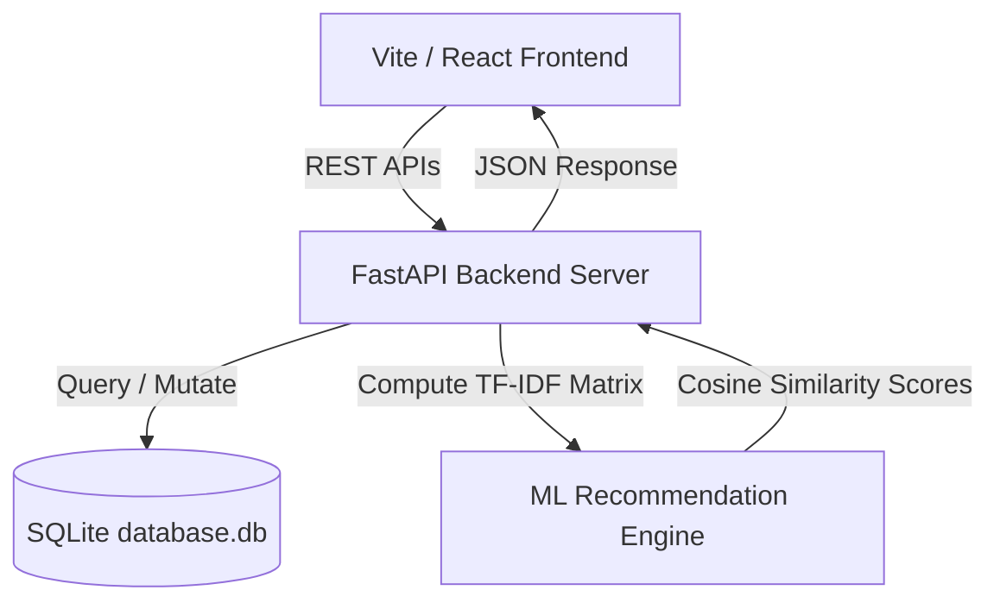

# 🌌 SalesGenie AI: B2B Lead Intelligence & CRM Deal Analytics Platform

SalesGenie AI is a premium, full-stack web application designed for B2B CRM lead tracking, pipeline management, and AI-enabled sales outreach. It combines a robust **Python FastAPI backend** executing machine learning similarity matching algorithms on historical deals with a beautiful, responsive **React + Tailwind CSS frontend** implementing a glassmorphic dashboard interface.

---

## 🏗️ Architecture



---

## 🌟 Key Features

### 1. 🔍 Interactive Leads Explorer
*   **Search & Multi-Filtering:** Instantly filter prospect leads by Company Name, Contact Name, and Industry.
*   **Dynamic Sorting:** Sort leads on the fly by Score, Company Name, and Location.
*   **Rule-Based & ML-Enhanced Scoring:** Evaluates prospect parameters (company size, industry, email opens, website visits, demo requests) to generate a Lead Score ($0 - 100$) and Categorize them (Hot Lead, Warm Lead, Cold Lead, Low Priority).
*   **Detailed Insights & Activity Logging:** Register new activities (calls, emails, meetings, demos) that automatically update stages, scores, and categories.

### 2. 📋 Deal Pipeline Kanban Tracker
*   **Pipeline Stages:** Manage prospect progress across stages: *Lead*, *Contacted*, *Demo Scheduled*, *Proposal Sent*, *Negotiation*, *Closed Won*, and *Closed Lost*.
*   **Real-time Synchronization:** Move cards dynamically across lanes, which synchronizes updates directly to the database via API requests.

### 3. 🤖 AI Outreach Generator Workspace
*   **Contextual Pitch Drafting:** Automatically formulates customized client follow-up and sales messages using prospect metadata and core pain points.
*   **Channel Customization:** Adjust formatting automatically for **Email** (formal subject & headers), **WhatsApp** (including emojis and bolding), **LinkedIn** (professional networking note), or **SMS** (concise, under 300 characters).
*   **Tone Customizer:** Select from multiple settings including *Professional*, *Persuasive*, *Friendly*, or *Urgent*.

### 4. 📊 Lead Performance Analytics Dashboard
Custom-crafted responsive charts and summaries rendering analytics fetched from the database:
*   **Total Leads & Hot Leads:** Live counters of active prospects.
*   **Average Score & Conversion Rate:** Insights on pipeline quality.
*   **Stage & Industry Distributions:** Counts across categories.
*   **Location Analysis:** Average lead score and counts by city.
*   **Scatter Plot Analysis:** Engagement (Visits vs. Opens) mapped to company revenue.

---

## 🛠️ Technology Stack

### Backend (API & ML Engine)
*   **FastAPI:** High-performance, low-latency web framework for building APIs with Python.
*   **Uvicorn:** ASGI web server implementation.
*   **SQLite:** Relational database with pre-seeded B2B lead profiles.
*   **Scikit-Learn:** Employs `TfidfVectorizer` and Cosine Similarity (`linear_kernel`) to match active leads with historic converted deals based on tech stack and industry alignment.

### Frontend (User Interface)
*   **Vite + React:** Fast and optimized React development environment.
*   **Tailwind CSS:** Modern utility-first CSS styling.
*   **Lucide React:** Sleek, consistent line icon system.

---

## 📡 API Reference

The backend provides several REST endpoints:

| Endpoint | Method | Description |
| :--- | :---: | :--- |
| `/` | `GET` | Server status and documentation links. |
| `/api/leads` | `GET` | Fetches a filtered and sorted list of prospect leads. |
| `/api/leads` | `POST` | Registers a new B2B prospect lead, calculating its score. |
| `/api/leads/{id}` | `GET` | Retrieves detailed metadata, history, and similar converted deals. |
| `/api/leads/{id}` | `PUT` | Updates a lead's metadata, recalculating its score. |
| `/api/leads/{id}` | `DELETE` | Removes a lead from the CRM database. |
| `/api/leads/{id}/activities` | `POST` | Logs a new activity (call, email, demo, etc.), auto-progressing the stage. |
| `/api/generate-outreach` | `POST` | Generates a custom styled client outreach message. |
| `/api/analytics` | `GET` | Computes statistical summaries and data distributions for charts. |

---

## 🚀 How to Run the Project

### Prerequisites
*   Python 3.8+
*   Node.js 18+ & npm

### Step 1: Run the Backend Server
1. Navigate to the backend directory:
   ```bash
   cd backend
   ```
2. Install Python dependencies:
   ```bash
   pip install -r requirements.txt
   ```
3. Launch the FastAPI server:
   ```bash
   python server.py
   ```
*The backend API documentation will be available at `http://127.0.0.1:8000/docs`.*

### Step 2: Run the Frontend App
1. Navigate to the frontend root directory:
   ```bash
   cd ..
   ```
2. Install Node dependencies:
   ```bash
   npm install
   ```
3. Run the development server:
   ```bash
   npm run dev
   ```
*Open `http://localhost:5173/` in your browser to view the application.*
