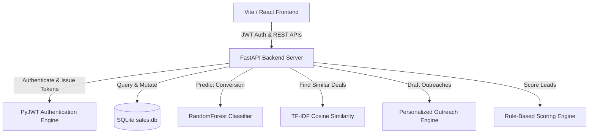

# 🌌 SalesGenie AI: AI Sales Assistant & Lead Intelligence Platform

SalesGenie AI is a premium, full-stack AI-powered Sales Assistant and Lead Intelligence Platform developed as an **Infosys Springboard Internship** project. It automates lead analysis, prospect research, personalized outreach generation, lead scoring, and follow-up recommendations. The platform combines a robust **Python FastAPI backend** with machine learning (RandomForest, TF-IDF) and a beautiful, responsive **React + Tailwind CSS frontend** implementing a glassmorphic dashboard interface.

---

## 📌 Project Statement

Modern sales teams spend a significant amount of time researching prospects, analysing company information, preparing outreach messages, tracking customer interactions, and identifying high-potential opportunities. Manual lead qualification and sales outreach often result in inconsistent engagement, lower conversion rates, and reduced productivity.

**SalesGenie AI** addresses this by providing:
- Centralized prospect and lead management platform
- AI-powered company profile analysis and lead intelligence generation
- Personalized cold email and outreach message generation
- Automated lead scoring based on conversion probability
- AI-generated follow-up strategies and sales recommendations
- Sales performance analytics and business intelligence dashboard
- Secure JWT (JSON Web Token) user authentication & session management

---

## 🏗️ Architecture


```mermaid
graph TD
    A[Vite / React Frontend] -->|JWT Auth & REST APIs| B[FastAPI Backend Server]
    B -->|Authenticate & Issue Tokens| H[PyJWT Authentication Engine]
    B -->|Query & Mutate| C[(SQLite sales.db)]
    B -->|Predict Conversion| D[RandomForest Classifier]
    B -->|Find Similar Deals| E[TF-IDF Cosine Similarity]
    B -->|Draft Outreaches| F[Personalized Outreach Engine]
    B -->|Score Leads| G[Rule-Based Scoring Engine]
```

---

## 📦 Modules

The project is organized into **6 core modules**:

### Module 1: Lead Management & Prospect Database
Create and manage prospect and customer records. Store company profiles, contact details, and engagement history. Track lead lifecycle and sales stages.

- **Lead Registration** — CRUD operations for prospect leads with company, contact, industry, tech stack, and funding details
- **Company Profile Storage** — Detailed company information (size, revenue, location, technology stack)
- **Contact Management** — Multiple contacts linked to each company with roles and designations
- **Engagement History Tracking** — Chronological timeline of all interactions (calls, emails, demos, meetings)
- **Sales Stage Tracking** — Lead progression through stages: *Lead → Contacted → Demo Scheduled → Proposal Sent → Negotiation → Closed Won*

### Module 2: Lead Intelligence & Company Analysis
AI-powered lead analysis including technology alignment checking, decision maker identification, and similar deal matching.

- **AI Lead Analysis** — Analyzes customer behavior using engagement data (website visits, email opens, demo requests)
- **Technology Alignment** — Checks prospect's tech stack against our product stack for compatibility scoring
- **Decision Maker Identification** — Classifies contacts as Technical, Financial, or Executive Decision Makers
- **Similar Deals Finder** — Uses TF-IDF vectorization and cosine similarity to find matching converted deals

### Module 3: AI Outreach Generation
Generate personalized cold emails and sales messages. Create outreach content based on prospect profiles. Customize communication strategies for different industries.

- **Multi-Channel Outreach** — Generates personalized messages for **Email**, **LinkedIn**, **WhatsApp**, and **SMS**
- **Tone Customization** — Four AI pitch strategies: *Professional*, *Persuasive*, *Friendly*, *Urgent*
- **Industry-Specific Content** — Automatically references relevant case studies based on prospect industry
- **Pain Point Integration** — Tailors messaging around the prospect's specific business challenges

### Module 4: Lead Scoring & Recommendation Engine
Predict conversion likelihood using AI models. Assign lead scores based on engagement and company characteristics. Generate next-best-action recommendations.

- **Rule-Based Scoring** — Weighted formula evaluating company size (25), industry match (22), demo request (20), website visits (18), and email opens (15) out of 100
- **ML Conversion Prediction** — RandomForest Classifier trained on live CRM engagement data to predict conversion probability
- **Lead Classification** — Categorizes leads as *Hot Lead (81–100)*, *Warm Lead (61–80)*, *Cold Lead (41–60)*, *Low Priority (0–40)*
- **Next-Best-Action Recommendations** — Score-driven suggestions (schedule demo, send proposal, nurture with case studies)

### Module 5: Conversation Intelligence & CRM Integration
Activity timeline logging, engagement history tracking, automated stage progression, and user access security.

- **Activity Logging** — Log phone calls, emails, demos, proposals with automatic metric updates
- **Auto Stage Progression** — Activities trigger automatic sales stage advancement (e.g., demo request → "Product Demo" stage)
- **Engagement Metrics Update** — Email opens, website visits, and demo requests auto-increment on relevant activities
- **JWT Session Security** — User login/registration with signed JWT tokens (`HS256`, 24h expiration) and PBKDF2 password hashing

### Module 6: Dashboard & Sales Analytics
Sales performance analytics and business intelligence dashboard with key metrics.

- **KPI Dashboard** — Total Leads, Average Score, Hot Leads, Closed Won, Conversion Rate
- **Sales Stage Distribution** — Visual breakdown of leads across pipeline stages
- **Industry Analysis** — Lead distribution and conversion rates by industry
- **Location Intelligence** — Average lead scores and counts by city/region
- **Engagement Matrix** — Email opens vs. website visits correlation table with stage tracking

---

## 📅 Milestones

| Milestone | Weeks | Modules | Status |
|-----------|-------|---------|--------|
| **Milestone 1** — Lead Management & Intelligence Engine | Weeks 1–2 | Module 1 + Module 2 | ✅ Complete |
| **Milestone 2** — Outreach Generation & Lead Scoring | Weeks 3–4 | Module 3 + Module 4 | ✅ Complete |
| **Milestone 3** — CRM Integration & Conversation Intelligence | Weeks 5–6 | Module 5 | ✅ Complete |
| **Milestone 4** — Dashboard & Automation | Weeks 7–8 | Module 6 | ✅ Complete |

---

## 🛠️ Technology Stack

### Backend (API & ML Engine)
| Component | Technology |
|-----------|-----------|
| Web Framework | **FastAPI** (Python) |
| Authentication | **PyJWT** (JSON Web Tokens `HS256`) + PBKDF2-HMAC Password Hashing |
| ASGI Server | **Uvicorn** |
| Database | **SQLite** (relational, pre-seeded B2B lead profiles + users table) |
| ML Lead Scoring | **Scikit-Learn** — `RandomForestClassifier` for conversion prediction |
| Similar Deal Matching | **Scikit-Learn** — `TfidfVectorizer` + `linear_kernel` cosine similarity |
| Data Processing | **Pandas**, **NumPy** |
| API Validation | **Pydantic** (request/response models) |

### Frontend (User Interface)
| Component | Technology |
|-----------|-----------|
| Build Tool | **Vite** (fast HMR) |
| UI Library | **React 19** |
| Styling | **Tailwind CSS 3.4** |
| Icons | **Lucide React** |

---

## 📡 API Reference

| Endpoint | Method | Module | Description |
|----------|:------:|--------|-------------|
| `/` | `GET` | — | Server health check & documentation links |
| `/api/auth/register` | `POST` | M5 | Register new user & return signed JWT access token |
| `/api/auth/login` | `POST` | M5 | Authenticate credentials & return signed JWT access token |
| `/api/auth/me` | `GET` | M5 | Protected endpoint to retrieve authenticated JWT user profile |
| `/customer` | `POST` | M5 | Add customer record to CRM database |
| `/crm/push` | `POST` | M5 | Push customer data to external CRM systems |
| `/summarize` | `POST` | M5 | Summarize sales meeting transcript, sentiment & action items |
| `/summary/{meeting_id}` | `GET` | M5 | Retrieve meeting summary by Meeting ID |
| `/insights` | `POST` | M5 | Extract conversation insights (budget, interest, competitors) |
| `/api/leads` | `GET` | M1 | Fetch filtered, sorted list of prospect leads |
| `/api/leads` | `POST` | M1 | Register a new B2B prospect lead with auto-scoring |
| `/api/leads/{id}` | `GET` | M1, M2 | Retrieve lead detail with ML augmentation, similar deals, activities |
| `/api/leads/{id}` | `PUT` | M1 | Update a lead's metadata with score recalculation |
| `/api/leads/{id}` | `DELETE` | M1 | Remove a lead and associated activities |
| `/api/leads/{id}/activities` | `POST` | M5 | Log activity with auto stage progression & metric updates |
| `/api/generate-outreach` | `POST` | M3 | Generate personalized outreach message (4 channels × 4 tones) |
| `/api/analytics` | `GET` | M6 | Compute sales KPIs, distributions, and engagement data |


---

## 🔐 How to Find & Use the JWT Sign-In Screen

1. **Location in UI**: Look at the **bottom of the left navigation sidebar** (`Sidebar.jsx`).
2. **Button Name**: You will see a button labeled **`🔐 JWT Sign In / Register`**.
3. **Opening the Screen**: Click the button to launch the glassmorphic **JWT Authentication Modal** right in the center of your screen.
4. **Demo Credentials**:
   - **Username**: `admin`
   - **Password**: `admin123`
5. **Registration**: Click **Register Now** inside the modal to create a new user account with email verification and instant token issuance.
6. **Mobile Navigation**: On mobile/small screens, tap the top-left hamburger menu icon to open the sidebar, then scroll down to tap the **JWT Sign In / Register** button.

---

## 🚀 How to Run the Project

### Prerequisites
- Python 3.8+
- Node.js 18+ & npm

### Step 1: Run the Backend Server
```bash
cd salesgenie/backend
pip install -r requirements.txt
python server.py
```
*The backend API documentation will be available at `http://127.0.0.1:8000/docs`.*

### Step 2: Run the Frontend App
```bash
cd salesgenie
npm install
npm run dev
```
*Open `http://localhost:5173/` in your browser to view the application.*

---

## 📄 License

This project was developed as part of the **Infosys Springboard Internship Program**.
