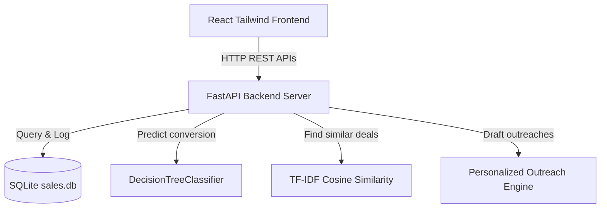

# SalesGenie AI: Enterprise Lead Intelligence & Outreach Platform

SalesGenie AI is a high-performance CRM analytics and lead intelligence application. It replaces the old anime-themed catalog template with an end-to-end sales prospecting hub driven by an SQLite relational database, rule-based scoring engines, decision-tree machine learning models, similar deal matches (TF-IDF vectorizer), and automatic outreach drafting.

---

## 🏗️ System Architecture



### 1. SQLite Relational Schema (`sales.db`)
The schema contains two normalized tables tracking lead details and historical interactions:
- **`leads`**: Stores company size, revenue scale, funding stage, technology stack, location, key pain points, and engagement metrics (email opens, website visits, demo requests, converted status, and pipeline stage).
- **`activities`**: Logs chronological timeline actions with status (e.g., outgoing calls, email openings, demos completed).

### 2. Machine Learning & Rules Engine (`server.py`)
- **Rule-Based Scoring**: Combines company size, industry match (weights software/finance/tech higher), website traffic, email click rates, and demo requests to score leads out of 100.
- **ML Conversion Classifier**: Fits a `scikit-learn` `DecisionTreeClassifier` over live engagement logs to output a conversion probability percentage.
- **TF-IDF Deal Matcher**: Vectorizes tech stacks, locations, and descriptions using `linear_kernel` cosine similarity to surface top converted profiles for reference.

### 3. Modern React Dashboard (`App.jsx`)
- **Leads Explorer**: Double-column panel grouping prospect lists (filtering by industry, lifecycle stages, and AI score ranges) and details view (including interactive stage selectors and deletion).
- **Interactive Timeline Quick Logs**: Buttons to instantly log phone calls, emails, and demos, which write to the database and trigger real-time AI score updates.
- **Sales Pipeline Kanban**: Six columns mapping deals from *Lead* up to *Closed Won*, allowing quick inline dropdown stage shifts.
- **AI Outreach Writer**: Personalized copy generator for Cold Emails, LinkedIn messages, WhatsApp, and SMS across four tones (*Professional, Persuasive, Friendly, Urgent*).
- **Analytics Dashboard**: Five KPI meters and four styled SVG graphics depicting volume, geographical score averages, correlation scatter charts, and conversion success rates.

---

## 📸 Interface Demonstration & Verification

Below are screenshots and recordings showing the verified user interface:

### 1. Interactive CRM Leads Explorer
The main catalog shows lead details, tech stacks, circular score meters, and engagement activity logging:


### 2. Sales Pipeline Kanban
Deals are organized visually to keep track of conversion progressions:


### 3. AI Outreach Composer
Outreach copy is automatically customized using target designation, funding, and pain points:


### 4. Sales Intelligence Analytics
Key business metrics and engagement correlation tables derived from the SQL backend:


---

## 🎥 Video Recording of UI Verification

The full web walkthrough showing interaction flow, tab navigation, and timeline logging can be viewed below:


---

## 🚀 Launch Instructions

Both services are active in your environment. If you ever need to manually restart them:

### Start Python REST API Backend
```bash
cd "/run/media/askshubh/New Volume/Downloads/Brave/archive/Infosys internship/salesgenie/backend"
python3 server.py
```
*API runs at `http://127.0.0.1:8000/api`*

### Start React Development Server
```bash
cd "/run/media/askshubh/New Volume/Downloads/Brave/archive/Infosys internship/salesgenie"
npm run dev
```
*Webapp runs at `http://localhost:5173/`*
