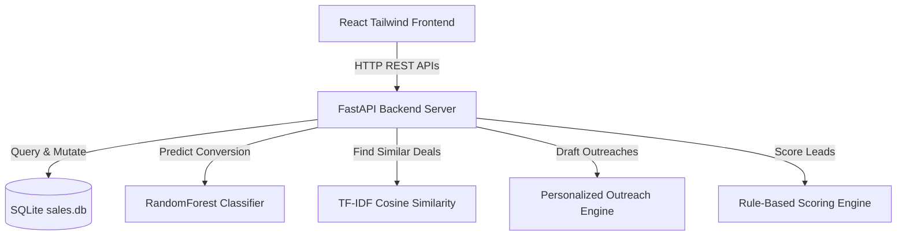

# SalesGenie AI: Implementation Summary

> Full-stack AI Sales Intelligence Platform — Infosys Springboard Internship Project

---

## 🏗️ System Architecture


```mermaid
graph TD
    A[React Tailwind Frontend] -->|HTTP REST APIs| B[FastAPI Backend Server]
    B -->|Query & Mutate| C[(SQLite sales.db)]
    B -->|Predict Conversion| D[RandomForest Classifier]
    B -->|Find Similar Deals| E[TF-IDF Cosine Similarity]
    B -->|Draft Outreaches| F[Personalized Outreach Engine]
    B -->|Score Leads| G[Rule-Based Scoring Engine]
```

---

## 📅 Milestones & Modules

### Milestone 1 (Weeks 1–2): Lead Management & Intelligence Engine
**Modules:** Module 1 (Lead Management & Prospect Database) + Module 2 (Lead Intelligence & Company Analysis)

**Implemented:**
- SQLite relational schema with `leads` and `activities` tables
- Lead CRUD operations (register, read, update, delete)
- Company profile storage (size, revenue, location, funding, tech stack)
- Contact management with role/designation tracking
- Engagement history timeline (calls, emails, demos, meetings)
- AI lead analysis with multi-factor scoring
- Technology alignment checking against product stack
- Decision maker identification (Technical/Financial/Executive)
- TF-IDF similar deal matching with cosine similarity
- Search & multi-filter prospect panel

### Milestone 2 (Weeks 3–4): Outreach Generation & Lead Scoring
**Modules:** Module 3 (AI Outreach Generation) + Module 4 (Lead Scoring & Recommendation Engine)

**Implemented:**
- Multi-channel outreach generation (Email, LinkedIn, WhatsApp, SMS)
- 4 tone strategies (Professional, Persuasive, Friendly, Urgent)
- Industry-specific case study references
- Pain point-driven message personalization
- Rule-based scoring engine (company size + industry match + demo request + engagement = 100)
- RandomForest Classifier for ML conversion prediction
- Lead classification (Hot/Warm/Cold/Low Priority)
- Next-best-action recommendation engine

### Milestone 3 (Weeks 5–6): CRM Integration & Conversation Intelligence
**Module:** Module 5 (Conversation Intelligence & CRM Integration)

**Implemented:**
- Activity logging with auto-metric updates
- Automatic stage progression on activity triggers
- Engagement metric counters (email opens, website visits, demo requests)

### Milestone 4 (Weeks 7–8): Dashboard & Automation
**Module:** Module 6 (Dashboard & Sales Analytics)

**Implemented:**
- 5 KPI cards (Total Leads, Avg Score, Hot Leads, Closed Won, Conversion Rate)
- Sales stage distribution chart
- Industry distribution chart
- Location score analysis
- Conversion rate by industry
- Engagement scatter matrix (email opens vs website visits)
- 6-column Kanban sales pipeline board

---

## 🛠️ Technology Stack

| Component | Technology |
|-----------|-----------|
| Backend | Python, FastAPI, Uvicorn |
| Database | SQLite |
| Machine Learning | Scikit-learn (RandomForest, TF-IDF) |
| Data Processing | Pandas, NumPy |
| API Validation | Pydantic |
| Frontend | Vite + React 19 |
| Styling | Tailwind CSS 3.4 |
| Icons | Lucide React |

---

## 🚀 Launch Instructions

### Start Python REST API Backend
```bash
cd salesgenie/backend
pip install -r requirements.txt
python server.py
```
*API runs at `http://127.0.0.1:8000/api` — Docs at `http://127.0.0.1:8000/docs`*

### Start React Development Server
```bash
cd salesgenie
npm install
npm run dev
```
*Webapp runs at `http://localhost:5173/`*
