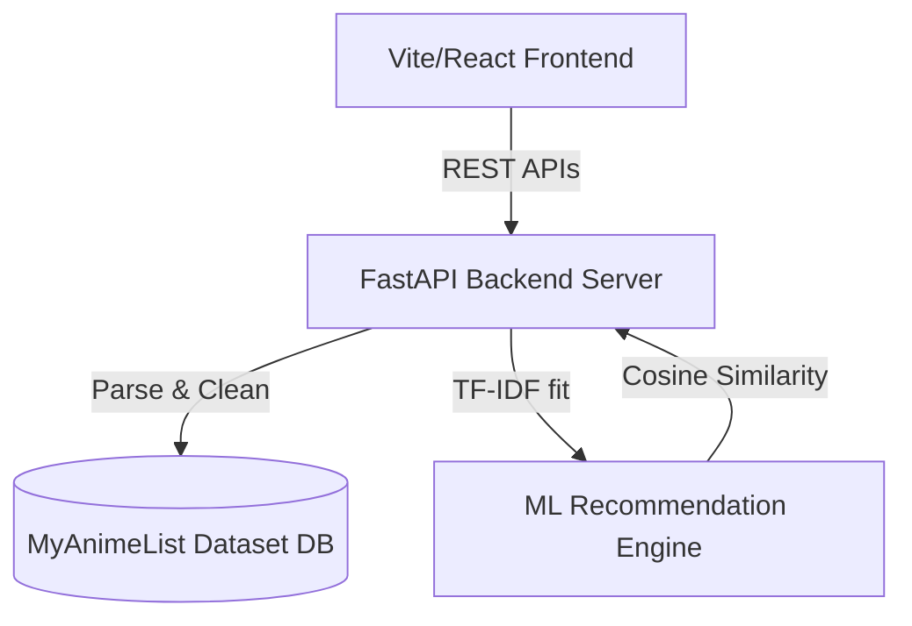

# AnimeGenie AI: ML Discovery & Intelligence Engine

AnimeGenie AI is a fully functional web application that replaces the original `SalesGenie` template. It utilizes a Python FastAPI backend to process a dataset of 10,000 anime records and implements content-based machine learning recommendations. The frontend is a modern React web application styled with glassmorphic purple themes.

---

## 🏗️ Architecture



### 1. Python Machine Learning Backend (`server.py`)
- **FastAPI Framework**: Exposes low-latency endpoints for querying the dataset.
- **Relational Joining Engine**: Dynamically matches anime IDs against multiple CSV relations (genres, studios, characters, voice actors, staff).
- **ML Recommender**: Fits a `TfidfVectorizer` over title text, genres, studio names, and synopsis keywords on startup. Uses `sklearn.metrics.pairwise.linear_kernel` to calculate cosine similarities on the fly in under `0.1s`.

### 2. React Frontend (`App.jsx`)
- **Anime Catalog**: A search and filtering middle panel alongside a detailed view. Shows a dynamic **Genie Affinity Match Score** computed against the user's genre preferences.
- **Watch Queue Tracker**: A visual Kanban pipeline mapping stages like *Plan to Watch*, *Watching*, *On Hold*, *Completed*, and *Dropped* (analogous to the original Lead Stage Tracker). Persists in `localStorage`.
- **AI Share Workspace**: Allows users to draft recommendation posts with customizable channels (WhatsApp, Discord, Social) and tones (Casual, Analytical, Excited, Poetic).
- **EDA Dashboard**: Interactive, custom SVG charts for data exploration:
  - Top 10 Genres (Anime Count)
  - Rating Performance by Format
  - Score vs Popularity Rank Correlation Scatter Plot
  - Anime Production Volume Trends (1990–2026)
  - Top 10 Studios by output and score (with placeholder filter cleanups)

---

## 🚀 How to Run the Project

Both the backend and frontend servers are currently running in the background. If you need to restart them in the future:

### Step 1: Start the Python Backend
Run from the `salesgenie/backend` directory:
```bash
python3 server.py
```
*Runs on `http://127.0.0.1:8000`*

### Step 2: Start the React Frontend
Run from the `salesgenie` directory:
```bash
npm run dev
```
*Runs on `http://localhost:5173/`*
