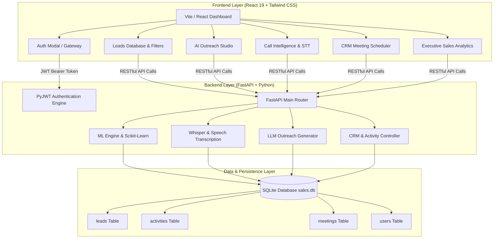

# 🌌 SalesGenie AI: AI Sales Assistant & Lead Intelligence Platform

[](https://fastapi.tiangolo.com)
[](https://react.dev)
[](https://tailwindcss.com)
[](https://sqlite.org)
[](https://scikit-learn.org)
[](https://pyjwt.readthedocs.io)
[](https://anime-genie-shubham-sharma.vercel.app/)
[](https://animegenie-shubhamsharma.onrender.com/)

**SalesGenie AI** is an enterprise-grade, full-stack AI-powered Sales Assistant and Lead Intelligence Platform developed as part of the **Infosys Springboard Internship Program**. It automates prospect research, multi-channel outreach generation, machine learning lead qualification, speech-to-text meeting intelligence, activity lifecycle management, and executive sales analytics.

---

## 🌐 Live Deployments

| Component | Platform | URL |
|---|---|---|
| **Live Frontend Web App** | Vercel | [https://anime-genie-shubham-sharma.vercel.app/](https://anime-genie-shubham-sharma.vercel.app/) |
| **Backend REST API** | Render Cloud | [https://animegenie-shubhamsharma.onrender.com/](https://animegenie-shubhamsharma.onrender.com/) |
| **Interactive OpenAPI Documentation** | Swagger UI | [https://animegenie-shubhamsharma.onrender.com/docs](https://animegenie-shubhamsharma.onrender.com/docs) |

---

## 📌 Problem Statement & Solution

Modern sales teams lose over **65% of their working hours** manually researching company data, crafting cold pitches, logging CRM interactions, and assessing deal conversion probability. 

**SalesGenie AI solves this with an end-to-end automated platform:**
1. **Automated B2B Prospect Profiling**: Real-time company tech stack alignment and decision-maker classification.
2. **AI Multi-Channel Outreach Writer**: Personalized cold messages tailored by tone (Professional, Persuasive, Friendly, Urgent) across Email, LinkedIn, WhatsApp, and SMS.
3. **Dual-Engine Lead Scoring**: Hybrid scoring combining an empirical 100-point rule formula with a Scikit-Learn `RandomForestClassifier` predicting conversion likelihood.
4. **Call & Meeting Intelligence**: Speech-to-text audio transcription (Faster-Whisper / Web Speech API), sentiment classification, and automated action item extraction.
5. **Meeting Scheduler & Activity Management**: Interactive scheduler with delete and mark-done status lifecycle management.
6. **Executive Analytics Dashboard**: Live sales KPI metrics, conversion funnels, industry distributions, and engagement matrix correlation.
7. **Enterprise Security**: JSON Web Token (JWT) session security with PBKDF2 password encryption.

---

## 🏗️ Architecture & System Design


```mermaid
graph TD
    subgraph "Frontend Layer (React 19 + Tailwind CSS)"
        A[Vite / React Dashboard] --> B[Auth Modal / Gateway]
        A --> C[Leads Database & Filters]
        A --> D[AI Outreach Studio]
        A --> E[Call Intelligence & STT]
        A --> F[CRM Meeting Scheduler]
        A --> G[Executive Sales Analytics]
    end

    subgraph "Backend Layer (FastAPI + Python)"
        B -->|JWT Bearer Token| H[PyJWT Authentication Engine]
        C & D & E & F & G -->|RESTful API Calls| I[FastAPI Main Router]
        I --> J[ML Engine & Scikit-Learn]
        I --> K[Whisper & Speech Transcription]
        I --> L[LLM Outreach Generator]
        I --> M[CRM & Activity Controller]
    end

    subgraph "Data & Persistence Layer"
        J & K & L & M --> N[(SQLite Database sales.db)]
        N --> O[leads Table]
        N --> P[activities Table]
        N --> Q[meetings Table]
        N --> R[users Table]
    end
```

---

## 📦 Core Modules Breakdown

The platform is structured into **6 integrated modules**:

### 🏢 Module 1: Lead Management & Prospect Database
- **CRUD Operations**: Comprehensive registration, editing, sorting, and deletion of B2B prospect records.
- **Company Profile Intelligence**: Enriched company metadata including industry, annual revenue, employee count, and geographic location.
- **Contact Management**: Associate decision-makers with specific titles, emails, and phone numbers.
- **Sales Pipeline Lifecycle**: Track lead progression through: *New Lead → Contacted → Demo Scheduled → Proposal Sent → Negotiation → Closed Won*.

### 🧠 Module 2: Lead Intelligence & Company Analysis
- **Technology Alignment Score**: Automatically compares a prospect’s stack (e.g., AWS, React, Python, PostgreSQL) with our product compatibility.
- **Decision Maker Classification**: Identifies whether a contact represents a *Technical*, *Financial*, or *Executive* stakeholder.
- **Similar Converted Deals**: Utilizes `TfidfVectorizer` and Cosine Similarity to recommend past won deals with similar company characteristics.

### ✍️ Module 3: AI Outreach Generation
- **Multi-Channel Delivery**: Instant message generation for **Email**, **LinkedIn InMail**, **WhatsApp**, and **SMS**.
- **Tone Personalization**: 4 pitch strategies (*Professional*, *Persuasive*, *Friendly*, *Urgent*).
- **Case Study Referencing**: Injects industry-relevant ROI proof points automatically.
- **Pain Point Matching**: Aligns messaging with specific organizational challenges.

### 🎯 Module 4: Lead Scoring & Recommendation Engine
- **Empirical Scoring Formula**: Weighted 100-point algorithm evaluating Company Size (25 pts), Industry Match (22 pts), Demo Requests (20 pts), Website Visits (18 pts), and Email Opens (15 pts).
- **Machine Learning Conversion Prediction**: `RandomForestClassifier` trained on historical CRM win/loss records.
- **Lead Tiers**: *Hot Lead (81–100)*, *Warm Lead (61–80)*, *Cold Lead (41–60)*, *Low Priority (0–40)*.
- **Next Best Action**: Context-aware recommendations (e.g., *Schedule Technical Demo*, *Send Executive Proposal*).

### 🎙️ Module 5: Conversation Intelligence, Meeting Scheduler & CRM Integration
- **Speech-to-Text Transcription**: Browser Web Speech API & Whisper STT engine for sales call audio processing.
- **Sentiment & Polarity Analysis**: Determines sentiment (*Positive - High Intent*, *Neutral*, *Needs Attention*) and extracts competitor mentions.
- **Action Item Extraction**: Generates follow-up tasks with assignees and due dates.
- **Meeting Scheduler**: Book client meetings with calendar integration.
- **Activity Lifecycle Management**: Real-time **Mark Done** (`PATCH /api/activities/{id}/status`) and **Delete** (`DELETE /api/activities/{id}`) capabilities.

### 📊 Module 6: Executive Dashboard & Sales Analytics
- **Live KPI Summary**: Real-time computation of Total Leads, Avg Score, Hot Leads, Closed-Won Deals, and Conversion Rate %.
- **Pipeline Stage Distribution**: Visual funnel representation of active deals.
- **Industry & Sector Breakdown**: Conversion rate comparison across FinTech, Healthcare, E-Commerce, SaaS, and Manufacturing.
- **Lead Engagement Matrix**: Correlation table tracking email open rates against website visit frequency.

---

## 📅 Internship Milestones & Delivery Matrix

| Milestone | Scope | Modules Included | Status |
|---|---|---|:---:|
| **Milestone 1** | Lead Management & Intelligence Engine | Module 1 + Module 2 | ✅ Verified & Complete |
| **Milestone 2** | AI Outreach Generation & Lead Scoring | Module 3 + Module 4 | ✅ Verified & Complete |
| **Milestone 3** | CRM Integration & Call Intelligence | Module 5 | ✅ Verified & Complete |
| **Milestone 4** | Executive Dashboard & Production Automation | Module 6 | ✅ Verified & Complete |

---

## 📡 REST API Reference

| Endpoint | Method | Module | Description |
|---|:---:|:---:|---|
| `/` | `GET` | Core | System health check & service metadata |
| `/api/auth/register` | `POST` | Auth | Register new user & return signed JWT access token |
| `/api/auth/login` | `POST` | Auth | Authenticate credentials & return signed JWT token |
| `/api/auth/me` | `GET` | Auth | Retrieve authenticated user profile via Bearer Token |
| `/api/leads` | `GET` | M1 | Fetch filtered, searched, and sorted list of leads |
| `/api/leads` | `POST` | M1 | Create new B2B prospect lead with automated score |
| `/api/leads/{id}` | `GET` | M1, M2 | Get detailed lead data with similar deals & ML score |
| `/api/leads/{id}` | `PUT` | M1 | Update lead information and recalculate score |
| `/api/leads/{id}` | `DELETE` | M1 | Delete lead and associated timeline history |
| `/api/leads/{id}/activities` | `POST` | M5 | Log interaction activity with auto stage advancement |
| `/api/generate-outreach` | `POST` | M3 | Generate personalized multi-channel sales pitch |
| `/api/upload-audio` | `POST` | M5 | Upload and transcribe sales audio file via Whisper STT |
| `/api/insights` | `POST` | M5 | Extract budget, interest, and competitor insights |
| `/api/meetings/schedule` | `POST` | M5 | Schedule a client meeting and log to activities |
| `/api/activities/{id}/status` | `PATCH` | M5 | Update activity status (e.g. Mark as Completed) |
| `/api/activities/{id}` | `DELETE` | M5 | Remove scheduled meeting from timeline |
| `/api/meetings/latest` | `GET` | M5 | Retrieve latest analyzed meeting transcript & insights |
| `/api/analytics` | `GET` | M6 | Calculate pipeline KPIs, funnels, and industry metrics |

---

## 🔐 Authentication & Security

SalesGenie AI features end-to-end token security:
- **Algorithm**: `HS256` HMAC-SHA256 signature algorithm.
- **Password Protection**: Secure PBKDF2 password hashing.
- **Session Duration**: 24-hour expiration token with client-side header injection (`Authorization: Bearer <token>`).
- **Demo Credentials**:
  - **Username**: `admin`
  - **Password**: `admin123`
- **Location in Interface**: Click **🔐 JWT Sign In / Register** in the bottom left sidebar to open the authentication modal.

---

## 🛠️ Technology Stack

### Backend
- **Python 3.8+**
- **FastAPI** & **Uvicorn**
- **SQLite3**
- **Scikit-Learn** (`RandomForestClassifier`, `TfidfVectorizer`)
- **Pandas** & **NumPy**
- **PyJWT** & **Passlib**

### Frontend
- **React 19**
- **Vite**
- **Tailwind CSS 3.4**
- **Lucide React Icons**
- **HTML5 Web Speech API**

---

## 💻 Local Installation & Setup

### 1. Clone the Repository
```bash
git clone https://github.com/shubh152205/AnimeGenie_ShubhamSharma.git
cd AnimeGenie_ShubhamSharma
```

### 2. Backend Setup
```bash
cd backend
python -m venv venv
source venv/bin/activate  # On Windows: venv\Scripts\activate
pip install -r requirements.txt
python server.py
```
*Backend runs on `http://127.0.0.1:8000` with Swagger docs at `http://127.0.0.1:8000/docs`.*

### 3. Frontend Setup
```bash
# In project root or frontend directory:
npm install
npm run dev
```
*Frontend runs on `http://localhost:5173`.*

---

## 📄 License & Acknowledgments

Developed by **Shubham Sharma** under the **Infosys Springboard Internship Program (2026)**.
All rights reserved.
